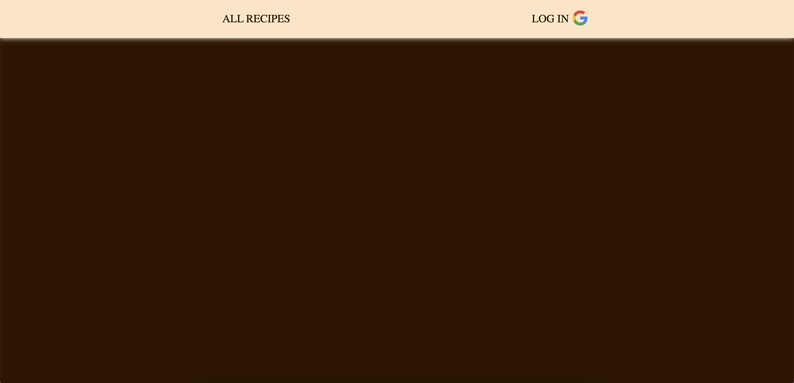
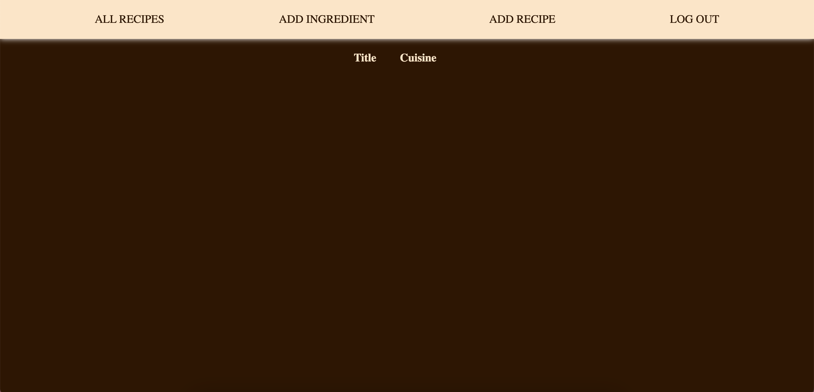
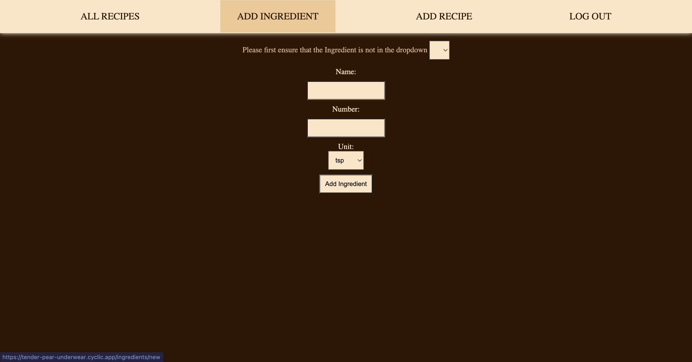
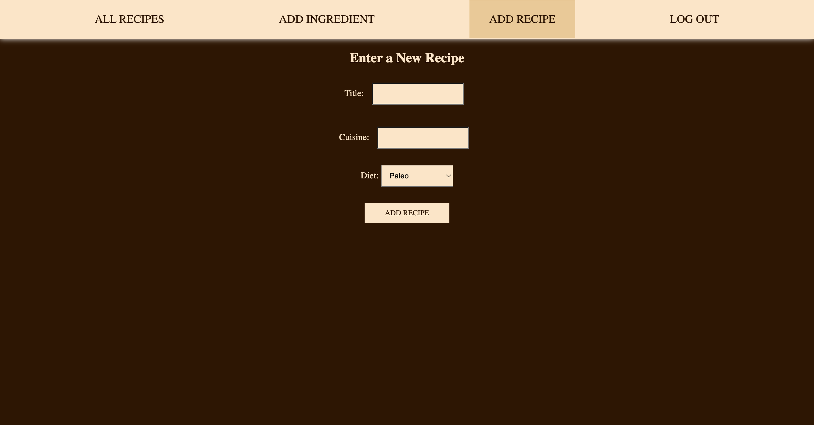
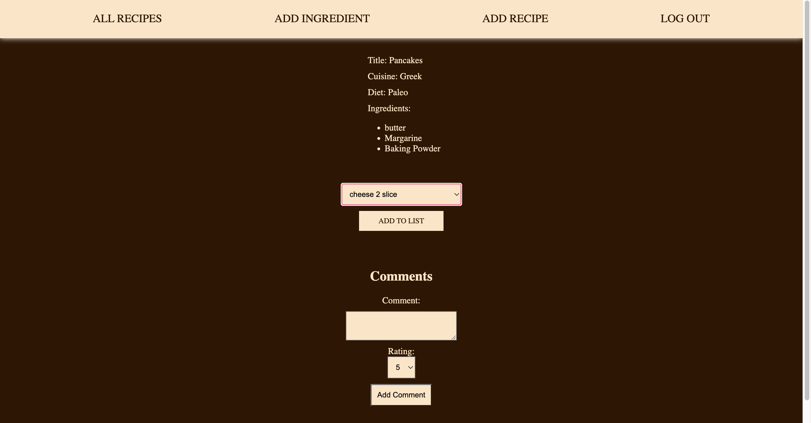
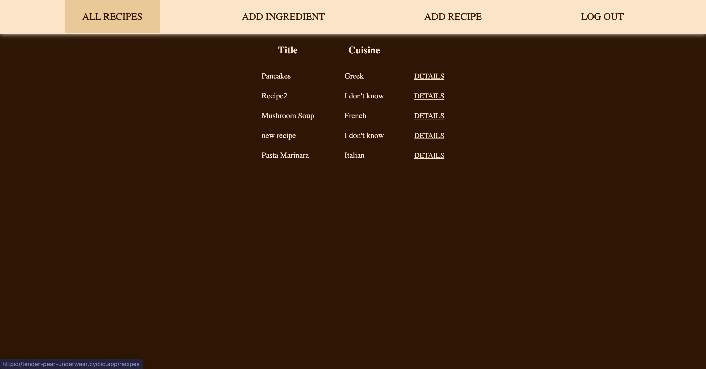

Hello everyone! This is a "RECIPE BOOK", where you can create your own recipes, add ingredients to your recipes and even get comments from other users!

Click on this link to get to the web-site:
https://tender-pear-underwear.cyclic.app

# Markdown and Visual Studio Code

The images below will help you to understand how to use the applicaation.

Technologies Used:
 - HTML
 - CSS
 - JavaScript
 - MongoDB
 - Node.js
 - Express.js